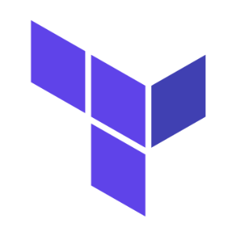

# Cohesity Terraform Provider



## Overview

This project provides a Terraform Provider for interacting with the [Cohesity DataPlatform](https://www.cohesity.com/products/data-platform). It includes Terraform modules useful for automating common tasks and orchestrating workflows in your environment.

## Table of contents :scroll:

 - [Requirements](#get-startedt)
 - [Building the Provider](#building)
 - [Documentation](#doc)
 - [How can you contribute](#contribute)
 - [Suggestions and Feedback](#suggest)
 

## <a name="get-started"></a> Let's get started :hammer_and_pick:

The pre-requisites for using the Cohesity Terraform Provider are as below:

- Terraform 0.12.4+

- Go 1.12.6+ (to build the provider plugin)

## <a name="building"></a> Building the Provider :gear:

- Install Go and setup the GOPATH

- create the directory $GOPATH/src/github.com/cohesity <br>

```
  mkdir -p $GOPATH/src/github.com/cohesity
  cd $GOPATH/src/github.com/cohesity
```

- clone the cohesity terraform provider repository <br>

```
  git clone https://github.com/cohesity/terraform-provider-cohesity.git
```

- clone v1.1.2 branch of cohesity management sdk for go <br>

```
  git clone -b v1.1.2 https://github.com/cohesity/management-sdk-go.git 
  go get github.com/hashicorp/terraform
  go get github.com/satori/go.uuid
  go get github.com/apimatic/form
  go build $GOPATH/src/github.com/cohesity/terraform-provider-cohesity
```

 - If you want to build a binary for different OS and platform, set `GOOS` and `GOARCH` environment variables for target operating system and architecture

- You can find the cohesity provider binary in `$GOPATH/bin`

## <a name="doc"></a> Documentation :book:

* [Documentation for Cohesity Terraform Provider](https://github.com/cohesity/terraform-provider-cohesity/tree/master/docs).


## <a name="contribute"></a> Contribute :handshake:

* [Refer our contribution guideline](https://github.com/cohesity/terraform-provider-cohesity/tree/master/CONTRIBUTING.md).

## <a name="suggest"></a> Suggestions and Feedback :raised_hand:

We would love to hear from you. Please send your suggestions and feedback to: [cohesity-api-sdks@cohesity.com](mailto:cohesity-api-sdks@cohesity.com)

## License

Apache 2.0
